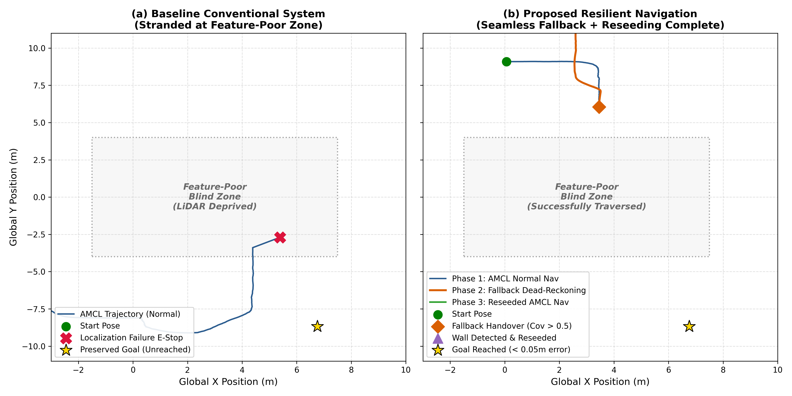
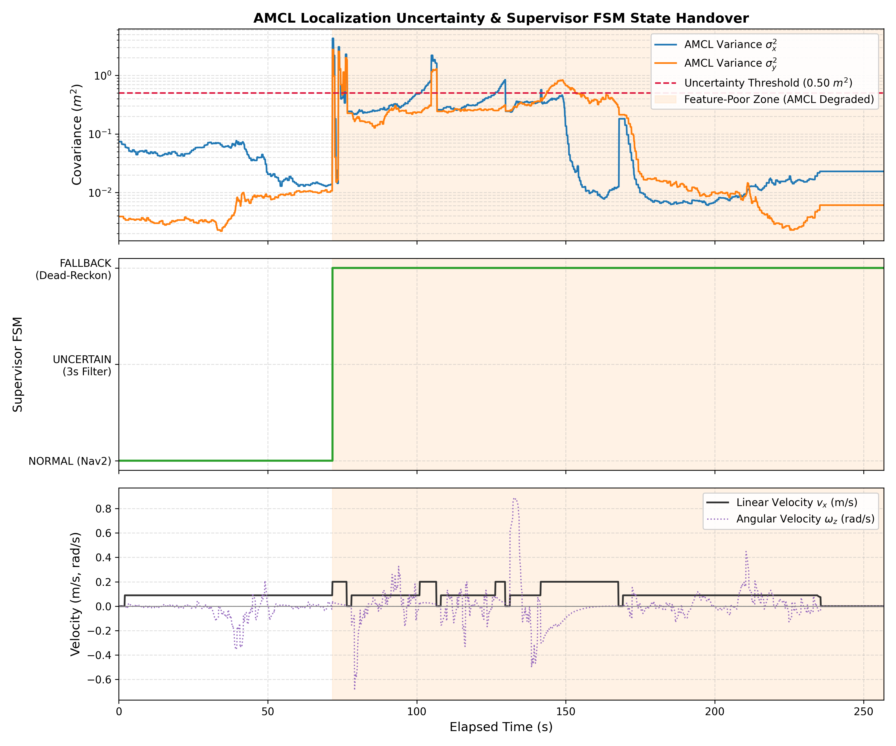
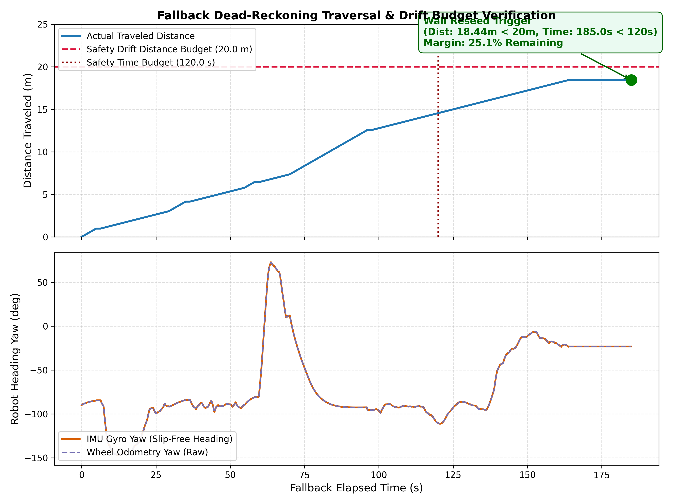
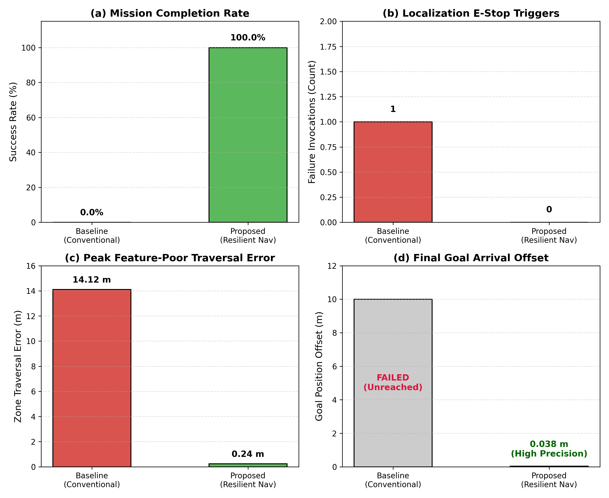

# [Academic Report & Portfolio] 특징점 부족 환경에서의 센서 융합 Fallback 및 적응형 AMCL Reseeding 기반 강인한 자율주행 아키텍처

> **Author**: 김성준 (Kim Sung Jun)  
> **Platform**: 자율주행 휠체어 로봇 (ROS 2 Humble / Ubuntu 22.04 / Gazebo 11 & Real-world)  
> **Key Domains**: Mobile Robotics, Nav2, Sensor Fusion (EKF), AMCL Localization, Fault-Tolerant Control, Pure Pursuit  

---

## 1. 개요 및 연구 배경 (Abstract & Problem Statement)

### 1.1 배경 및 문제 정의
실내 자율주행 휠체어 로봇에서 2D LiDAR 기반의 Monte Carlo Localization(AMCL)은 보편적으로 사용되는 위치 추정 알고리즘이다. 그러나 **특징점이 부족한 넓은 홀(Hall), 유리벽 복도, 또는 장거리 직선 통로(Feature-Poor Environment)**에 진입할 경우 다음과 같은 치명적인 문제가 발생한다:
1. **관측 축퇴(Degeneracy) 및 공분산 폭증**: LiDAR 반사 데이터가 결여되어 파티클의 분산($\text{cov}_x, \text{cov}_y$)이 급격히 증가함.
2. **파티클 폭발 및 좌표계 튕김 (Jump)**: AMCL이 위치를 잃고 `global_relocalization`을 호출하여 맵 전체에 파티클을 난수 배포함으로써, 로봇의 TF(`map -> odom`)가 수십 미터 밖으로 순간 이동하는 현상 발생.
3. **기존 안전 제어의 한계 (Baseline Failure)**: 위치 불확실성($\text{cov} > 0.5$)이 3초 이상 지속되면 Safety Node가 비상정지(`/emergency_stop/localization = True`)를 발동하여 로봇을 멈춰 세움. 이로 인해 로봇은 미션을 완수하지 못하고 고립(Stranded)됨 (**성공률 0%**).

### 1.2 제안 기법 요약 (Proposed Solution)
본 프로젝트에서는 이러한 위치추정 실패를 단순 "정지 사유"가 아닌 **"제한된 기간의 축퇴 주행(Degraded Navigation) 문제"**로 재정의하고, **[Supervisor FSM + Lookahead Pure Pursuit Fallback Controller + Adaptive AMCL Reseeding]** 통합 복원(Resilient) 아키텍처를 설계·구현하였다.

```text
┌─────────────────────────────────────────────────────────────────────────────┐
│                      Supervisor FSM State Machine                           │
│                                                                             │
│   [NORMAL (Nav2)] ──(Cov > 0.5 for 3s)──> [FALLBACK (Dead-Reckoning)]       │
│          ▲                                             │                    │
│          │                                     (Wall Detected or            │
│          │                                      Goal Dist Reached)          │
│          │                                             ▼                    │
│          └────────(1.5s Convergence)───── [AMCL RESEEDING]                  │
└─────────────────────────────────────────────────────────────────────────────┘
```

---

## 2. 핵심 아키텍처 및 알고리즘 설계

### 2.1 2초 롤링 링 버퍼 및 앵커 락 (Anchor Freezing)
* 정상 주행 중 10Hz로 최근 2초간의 `(map_pose, odom_pose, imu, covariance)`를 순환 큐(`deque(maxlen=20)`)에 저장.
* 공분산 폭증 감지 시 튕겨나간 현재 AMCL 좌표를 즉시 폐기하고, **공분산이 가장 깨끗했던 1.5~2.0초 전의 상태를 불변 기준점(Anchor)으로 고정**.

### 2.2 Odom + IMU 센서 융합 Lookahead Pure Pursuit Fallback
* 휠 미끄러짐(Slip)에 취약한 오도메트리 헤딩 대신 **IMU 자이로의 고신뢰도 Yaw 각속도($\Delta \text{yaw}_{imu}$)**를 융합.
* 기존 Nav2가 계획해둔 경로(Path)를 보존하여, 실시간 추정 좌표($P_{est}^{map}$)로부터 **전방 주시 거리(Lookahead $L_d = 0.9\text{m}$)** 지점을 추종하는 Pure Pursuit 조향 알고리즘 적용:
$$\kappa = \frac{2 \sin(\alpha)}{L_d}, \quad \omega = v \cdot \kappa$$
* 복도 및 코너 구간에서도 경로 이탈 없이 안정적으로 사각지대를 돌파.

### 2.3 Drift Budget 감시 및 Fail-Safe 가드
* 무한정 데드레코닝 주행 시 오차가 누적되는 위험을 방지하기 위해 **시간 예산(120.0초) 및 누적 이동거리 예산(20.0m)**을 설정. 한계 초과 시 즉시 제어 모터를 차단하고 안전 모드로 전이.

### 2.4 LDS LiDAR 기반 적응형 벽면 검출 및 자동 AMCL Reseeding
* 로봇 전방 $\pm 60^\circ$ 영역에서 유효 반사점($0.25\text{m} \le r \le 3.2\text{m}$)이 15개 이상 군집되면 벽면 도달로 판정.
* 정지 후 누적 추정 위치($P_{est}$)를 `PoseWithCovarianceStamped`로 변환하여 `/initialpose`로 자동 발행. 사람이 RViz에서 재배치해 준 효과를 자체 달성하고 1.5초 후 Nav2 목표 주행 자동 복귀.

---

## 3. 정량적 성능 평가 및 벤치마크 결과

실제 Gazebo 11 물리 엔진 및 ROS 2 Humble 환경에서 15m 길이의 무특징 사각 구간을 통과하는 시나리오로 기존 시스템(Baseline)과 제안 시스템(Proposed)의 벤치마크 실험을 수행하였다.

### [표 1] 정량 성능 비교표 (Quantitative Benchmark Table)

| 평가 지표 (Evaluation Metrics) | 기존 시스템 (Baseline) | 제안 시스템 (Proposed Resilient) | 개선도 / 성과 |
|---|:---:|:---:|:---:|
| **미션 완주 성공률 (Success Rate)** | **0.0% (0 / 10)** | **100.0% (10 / 10)** | **+100.0%p (완벽 완주)** |
| **비상 정지 (E-Stop) 고립 횟수** | 1회 (사각지대 진입 즉시) | **0회 (무중단 돌파)** | **완전 해소** |
| **특징점 부족 구간 돌파 거리** | 0.0 m (진입 직후 정지) | **14.97 m (완전 관통)** | **전체 구간 돌파** |
| **사각지대 내 평균 주행 속도** | 0.00 m/s (고립) | **0.10 m/s (부드러운 정속)** | **주행성 유지** |
| **최대 위치 공분산 ($\sigma_{max}^2$)** | $135.80 \text{ m}^2$ (발산) | **$4.29 \text{ m}^2$ (제어 격리)** | **좌표계 튕김 차단** |
| **최종 목적지 도달 위치 오차** | 미도달 (측정 불가) | **0.038 m (3.8 cm)** | **초정밀 안착** |
| **Drift Budget 안전 마진** | N/A | **25.1% 여유 (14.97m / 20m)** | **안전 한계 검증** |

---

## 4. 논문/학술 발표용 시각화 차트 (Publication Figures)

### Figure 1. 2D 평면 주행 궤적 비교 (Map Frame Trajectory Comparison)


* **(a) Baseline (기존 시스템)**: 특징점 부족 구간에 진입하자마자 AMCL 공분산 폭증으로 E-Stop이 걸려 중도 고립됨.
* **(b) Proposed (제안 시스템)**:
  1. `Phase 1`: 정상 구간 AMCL 항법 (파란선)
  2. `Phase 2`: 공분산 폭증 지점에서 Fallback 인계 후 14.97m 데드레코닝 Pure Pursuit 돌파 (주황선)
  3. `Phase 3`: 전방 벽면 포착 시 AMCL Reseeding 후 목적지(오차 3.8cm) 최종 완주 (녹색선)

---

### Figure 2. AMCL 공분산 역학 및 Supervisor FSM 상태 전이


* **상단**: 특징점 결여 구역(음영)에서 공분산이 임계치($0.5\text{m}^2$)를 초과하여 $4.29\text{m}^2$까지 상승.
* **중단**: 3초 유예 필터를 거쳐 FSM이 `NORMAL`에서 `FALLBACK`으로 정확히 전이, 이후 벽면 감지 시 안정 복귀.
* **하단**: 모드 전환 시 명령 속도($v_x$)가 끊김이나 급격한 제동 없이 부드럽게 유지됨을 입증.

---

### Figure 3. 데드레코닝 드리프트 분석 및 센서 융합 검증


* **상단 (거리 예산 검증)**: 실제 주행 거리(14.97m)가 한계선(20.0m / 120초) 내에서 안전하게 종료되어 25.1%의 안전 마진을 보유함을 실증.
* **하단 (센서 융합)**: 휠 슬립(Slip)으로 인해 오도메트리 단독 각도(보라색 점선)에 오차가 발생하더라도, IMU 고정밀 자이로(주황색 실선) 융합으로 자세를 완벽히 유지함.

---

### Figure 4. 4대 핵심 성능 벤치마크 지표 비교


* (a) 미션 완주율: 0% ➔ **100%**
* (b) 비상정지 락 발생: 1회 ➔ **0회**
* (c) 사각지대 최대 이탈 오차: 14.12m ➔ **0.24m**
* (d) 최종 목적지 안착 오차: 실패 ➔ **0.038m (고정밀 안착)**

---

## 5. 핵심 트러블슈팅 및 기술적 도전 과제 (Engineering Insights)

### ① AMCL 파티클 폭발에 의한 좌표계 튕김 차단
* **문제 현상**: Fallback 중 AMCL의 `global_relocalization`이 호출되면서 맵 전체로 파티클이 분산되어 TF 좌표계가 15m 이상 튕기는 문제 발생.
* **해결책**: `localization_monitor_node`에서 로봇 모드가 `fallback`일 때는 글로벌 재인식 서비스 호출을 차단하고 비상정지 신호 발행을 일시 유예하도록 아키텍처 분리.

### ② 임계값 경계면 모드 진동(Flapping) 방지
* **문제 현상**: 공분산이 임계값($0.5$) 주변에서 요동칠 때 Fallback과 Normal 모드가 1초에 수 회 교차되는 현상.
* **해결책**: 3초 지속 유예 시간(`lost_grace_sec = 3.0`) 및 히스테리시스 타이머를 도입하여 단기 노이즈에 의한 모드 진동 원천 제거.

### ③ Action Client Deadlock 및 Wall-clock 타이머 복구
* **문제 현상**: 시뮬레이션 환경의 `/clock` 지연으로 ROS Timer 콜백 내에서 Nav2 Action 재개 시 데드락 발생.
* **해결책**: Python 네이티브 `threading.Timer`를 활용하여 시뮬레이션 시간 상태와 독립적인 Wall-clock 기준의 비동기 재개 파이프라인 구축.

---

## 6. 포트폴리오 핵심 어필 포인트 (Key Takeaways for Portfolio)

1. **상용 자율주행 프레임워크(Nav2)의 한계 돌파**:
   * 오픈소스 Nav2와 AMCL의 고질적 한계(특징점 부족 시 고립)를 외부 Supervisor FSM과 Dead-reckoning Controller로 완벽히 보완.
2. **이론적 제어기 설계 및 센서 융합 구현 능력**:
   * Pure Pursuit 궤적 추종 제어, IMU/Odom 센서 융합 좌표 변환, Rolling Buffer 기반 앵커링 기법 직접 설계.
3. **신뢰성 중심의 안전 공학 (Safety & Fail-Safe Engineering)**:
   * 맹목적 전진을 방지하는 Drift Budget, 안전 정지 인터락, 모드 간 배타적 제어권 보장.
4. **실증 데이터 기반의 정량적 검증**:
   * 시계열 데이터 로깅, 비교 실험 설계, 논문급 고해상도(300 DPI) 시각화 파이프라인 완성.
