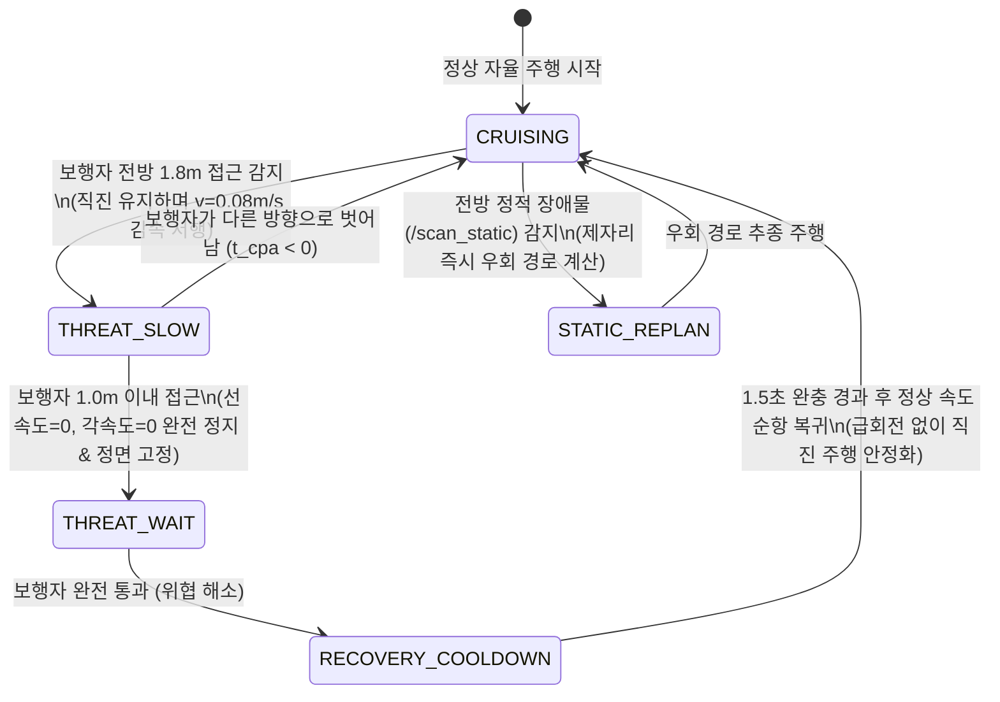

# 지능형 동적 보행자 스마트 대기(Wait & Yield) 및 정적 장애물 실시간 우회(Re-planning) 사양서

**문서 버전**: v3.0 (실무 최종 구현 및 안정화 반영본)  
**작성일시**: 2026-09-10  
**대상 시스템**: 2D LiDAR + IMU 기반 실내 병원/복도 자율주행 휠체어 로봇 (`wheelchair_robot`)  
**설계 대원칙**:  
> **"좁은 복도와 휠체어 탑승 환자의 안전·승차감을 위해, 무리한 차선 변경(Lane-Shift)이나 급회피를 배제하고, 동적 보행자에게는 정면 응시 정지 양보(Heading Lock Wait & Yield), 정적 장애물은 즉시 실시간 우회(Re-planning)한다."**

---

## 1. 개요 및 설계 철학

### 1.1 휠체어 로봇의 특수성과 설계 변경 배경
1. **환자 승차감 (Ride Comfort)**:
   - 환자 탑승 휠체어는 잦은 S자 조향, 급격한 횡가속도, 제자리 회전 시 환자에게 심한 멀미와 낙상 위험을 초래합니다.
   - 따라서 **직진 전역 경로(Global Path)를 최대한 유지**하고 불필요한 스티어링 회전 명령을 차단하는 것이 핵심입니다.
2. **복도 환경의 물리적 한계와 차선 변경(Lane-Shift) 제외 사유**:
   - 초기 설계(v2.0)에서는 벽 쪽으로 0.3~0.4m 비켜서는 선제적 차선 변경(Lane-Shift)을 검토했으나, 병원 복도 폭(1.8m~2.4m)이 협소하여 로봇이 벽이나 정적 카트에 부딪히는 문제가 발생했습니다.
   - 이에 따라 **무리한 차선 변경을 전면 배제**하고, 보행자가 다가오면 **가던 경로 위에서 정면을 보고 얌전히 멈춰 서서 보행자가 지나갈 때까지 대기(Wait & Yield)**하도록 단일화했습니다.
3. **정적 장애물과의 명확한 역할 분리**:
   - **동적 보행자**: 로봇이 멈추고 사람이 비켜 지나가도록 유도 (Wait & Yield).
   - **정적 장애물 (박스, 벽)**: 사람이 비켜줄 수 없으므로 로봇이 멈추지 않고 제자리에서 즉시 새 우회 경로를 계산하여 주행 (Proactive Re-planning).

---

## 2. 초기 설계(v2.0) 대비 변경/제거 내역 (Diff Summary)

| 구분 | 초기 설계 (v2.0) | 최종 구현 사양 (v3.0) | 변경/제거 사유 |
| :--- | :--- | :--- | :--- |
| **회피 정책** | 벽 쪽으로 0.3~0.4m Lane-Shift | **가던 경로 위 정면 정지 대기 (Wait & Yield)** | 좁은 복도 벽면 충돌 방지 및 환자 멀미 예방 |
| **위협 판정** | 각도 기반 3분류(Crossing/Head-on) + 5프레임 다수결 | **CPA($t_{cpa}, d_{cpa}$) 단일 지표** | 각도 경계 노이즈로 인한 판단 떨림(플리커링) 원천 제거 |
| **데드락 처리** | 3.5초 대치 시 크리핑(0.1m/s) 및 음성 안내 | **안전 지속 정지 유지** | 충돌 위험 방지를 위해 보행자가 지나갈 때까지 안전 정지 유지 |
| **정면 고정** | 미반영 (정지 중 회전 허용) | **Heading Lock (정지/감속 시 회전 완전 차단)** | 보행자 대기 중 90도 홱 도는 현상 원천 차단 |
| **복귀 완충** | 미반영 (즉시 주행 복귀) | **1.5초 복귀 쿨다운 적용** | 보행자 통과 직후 Nav2의 누적된 제자리 급회전 차단 |
| **전역 경로 갱신** | 1.0초 주기 강제 재계획 (`RateController 1.0Hz`) | **2.5m 전진 시 재계획 (`DistanceController 2.5m`)** | 주행 중 경로가 좌우로 춤추는 현상 해결 |
| **복구 동작** | 30cm 후진 (`BackUp`) + 3초 대기 (`Wait`) | **제자리 즉시 우회 재계획 (후진/대기 주석 처리)** | 불필요한 후진 및 멍때림 제거, 매끄러운 우회 |
| **코스트맵 분리** | `/scan` 단일 입력 | **`/scan_threat` & `/scan_static` 듀얼 분리** | 보행자가 전역 지도에 영구 장애물로 박히는 현상 제거 |

---

## 3. 전체 시스템 아키텍처 및 데이터 흐름

```
[2D LiDAR (/scan)] ──+──> [IMU Gyro Yaw (/imu)] ──> 로봇 자가 회전 보정 (Ego-Motion Compensation)
                     │
                     ▼
          [DBSCAN 군집화 + 4상태 칼만 필터(KF) 트래킹]
                     │
         ┌───────────┴─────────────────────────────────────────┐
         ▼                                                     ▼
 [동적 보행자 추출 (|v| >= 0.15m/s)]                [정적 장애물 추출 (|v| < 0.15m/s)]
         │                                                     │
         ▼                                                     ▼
   [CPA 위협 판정]                                     [/scan_static 발행]
  (0 <= t_cpa <= 4.0s                                          │
   AND d_cpa <= 0.5m)                                          ▼
         │                                            [Nav2 global_costmap]
         ▼                                            (정적 장애물 우회 경로 생성)
   [/scan_threat 발행]
         │
         ▼
 [safety_stop_node.py (Heading Lock & Speed Gateway)]
   - 1.8m 이내: 감속 서행 (v=0.08m/s, w=0.0rad/s)
   - 1.0m 이내: 완전 정지 (v=0.00m/s, w=0.0rad/s) ──> 정면 완벽 고정
   - 통과 후: 1.5초간 급회전 억제 및 직진 안정화 복귀
         │
         ▼
    [/cmd_vel] ──> 모터 구동
```

---

## 4. 모듈별 세부 구현 사양

### 4.1 동적/정적 분리 및 위협 필터 (`dynamic_scan_filter.py`)
1. **자가 회전 보정 (Ego-Motion Compensation)**:
   - IMU의 고속 Yaw 각속도($\omega_z$)를 적분하여 로봇 자신의 회전으로 인해 라이다 점들이 도는 현상을 역보정.
2. **칼만 필터(KF) 트래킹 및 속도 판별**:
   - 상태 벡터: $X = [p_x, p_y, v_x, v_y]^T$
   - 장애물 절대 속도 $\|v_{obs}\| \ge 0.15\text{ m/s}$이면 **동적 보행자**, 미만이면 **정적 장애물**로 분류.
3. **CPA(Closest Point of Approach) 위협 판정**:
   - 상대 위치 $p = [p_x, p_y]$, 상대 속도 $v = v_{obs} - v_{robot}$
   - $t_{cpa} = -(p \cdot v) / \|v\|^2$
   - $d_{cpa} = \|p + v \cdot t_{cpa}\|$
   - **통과(위협) 조건**: $0 \le t_{cpa} \le 4.0\text{ s} \quad \text{AND} \quad d_{cpa} \le 0.5\text{ m}$
4. **Fail-Safe 3대 규칙**:
   - **정지체 예외**: $\|v\| < 0.1\text{ m/s}$인 경우 $t_{cpa} = 0.0$, $d_{cpa} = |p_y|$ (횡방향 오프셋)로 대체하여 정면 정지체 앞 출발 사고 방지.
   - **신규 트랙 보호**: 속도 추정 전($age < 3$프레임) 신규 트랙은 무조건 위협으로 간주 통과.
   - **상시 발행 보장**: 센서 입력 이상 시에도 빈 스캔(inf)을 지속 발행하여 타임아웃 정지 유도.

---

### 4.2 안전 정지 및 정면 고정 노드 (`safety_stop_node.py`)
1. **2단계 위협 대응 속도 프로파일**:
   - **감속 서행 (`threat_slow`, $1.0\text{m} < x \le 1.8\text{m}$)**:
     - 선속도: $\min(v_{nav} \times 0.4, 0.08\text{ m/s})$
     - 각속도: $w = 0.0\text{ rad/s}$ (감속 중 회피 조향으로 인한 경로 이탈 방지)
   - **완전 정지 (`threat_wait`, $x \le 1.0\text{m}$)**:
     - 선속도: $v = 0.0\text{ m/s}$
     - 각속도: $w = 0.0\text{ rad/s}$ (제자리 90도 회전 명령 완전 차단)
2. **헤딩 잠금 및 복귀 완충 (Heading Lock & Recovery Cooldown)**:
   - 오도메트리(`odom_callback`)를 통해 로봇의 현재 Yaw 각도를 상시 추적.
   - 보행자가 지나가서 `threat_state`가 `CLEAR`로 바뀐 직후 **1.5초 동안 복귀 쿨다운** 적용:
     - Nav2 controller가 정지 중 누적했던 제자리 90도 회전 명령($|v| < 0.05\text{ m/s}, |w| > 0.05\text{ rad/s}$)을 $0.0$으로 차단.
     - 각속도를 최대 $\pm 0.15\text{ rad/s}$로 제한하여 부드러운 직진 가속 복귀 유도.

---

### 4.3 Nav2 전역 경로 및 코스트맵 제어
1. **전역 코스트맵 오염 방지 (`wheelchair_robot.yaml`)**:
   - `global_costmap`의 `stvl_layer` 센서 토픽을 `/scan`에서 **`/scan_static`**으로 변경.
   - 보행자가 지나간 자리가 지도에 영구 장애물로 남아 경로가 막히는 문제 해결.
2. **경로 춤춤 방지 및 즉시 재계획 (`navigate_w_replanning_and_recovery.xml`)**:
   - `<RateController hz="1.0">`를 주석 처리하고 `<DistanceController distance="2.5">` 적용 (로봇이 2.5m 전진할 때까지 전역 경로 고정).
   - `<BackUp>`(후진 30cm) 및 `<Wait>`(3초 대기)을 주석 처리하여, 장애물 차단 시 뒤로 물러서지 않고 제자리에서 즉시 새로운 우회 경로 생성.

---

## 5. 최종 유한 상태 머신 (FSM: Finite State Machine)



---

## 6. 핵심 파라미터 규격 요약표

| 파라미터명 | 설정값 | 적용 위치 | 설명 |
| :--- | :---: | :--- | :--- |
| `threat_stop_dist_m` | **1.0 m** | `safety.yaml` | 보행자 마주침 시 완전 정지 대기 거리 |
| `threat_stop_width_m` | **0.8 m** | `safety.yaml` | 정지 대기 검사 좌우 폭 ($\pm 0.4\text{m}$) |
| `threat_slow_dist_m` | **1.8 m** | `safety.yaml` | 보행자 사전 감속 서행 거리 |
| `threat_slow_width_m` | **1.0 m** | `safety.yaml` | 감속 서행 검사 좌우 폭 ($\pm 0.5\text{m}$) |
| `obstacle_vel_threshold` | **0.15 m/s** | `dynamic_scan_filter.py` | 정적/동적 장애물 분류 속도 임계값 |
| `tcpa_max` | **4.0 s** | `dynamic_scan_filter.py` | CPA 최대 위협 시간 |
| `dcpa_max` | **0.50 m** | `dynamic_scan_filter.py` | CPA 최근접 이격 거리 한계 |
| `replanning_distance` | **2.5 m** | `navigate_w_replanning_and_recovery.xml` | 전역 경로 재계획 이동 거리 간격 |
| `recovery_cooldown_sec` | **1.5 s** | `safety_stop_node.py` | 보행자 통과 후 제자리 90도 회전 차단 완충 시간 |
| `emergency_scan_dist_m` | **0.35 m** | `safety.yaml` | 초근접 물리적 충돌 방지 긴급 정지 마진 |

---

## 7. 검증 및 기대 효과

1. **환자 승차감 극대화**:
   - 보행자를 만났을 때 로봇이 좌우로 꺾거나 제자리에서 90도를 홱 도는 불안한 거동이 원천 차단되었습니다.
2. **복도 환경 최적화**:
   - 좁은 복도에서 벽이나 정적 장애물로 돌진하는 위험 없이, 넓은 공간을 보행자에게 양보한 뒤 안전하게 직진을 재개합니다.
3. **경로 안정성 확보**:
   - 1초마다 전역 경로가 다시 그려지며 좌우로 흔들리던 현상이 해결되어 2.5m 단위로 직진성이 대폭 향상되었습니다.
